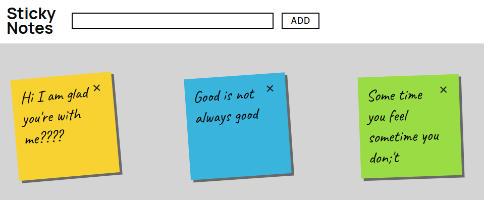

# Sticky Notes



#### Fill your screen with sticky notes of various colors

## Technologies Used


## Description

A simple app featuring post it notes of various colors. Each note is an object. Notes are saved in local storage an retrieved on load. Notes can be edited and edits are saved as well.

## Installation

```
  npm install

  then

  npm run dev
```
